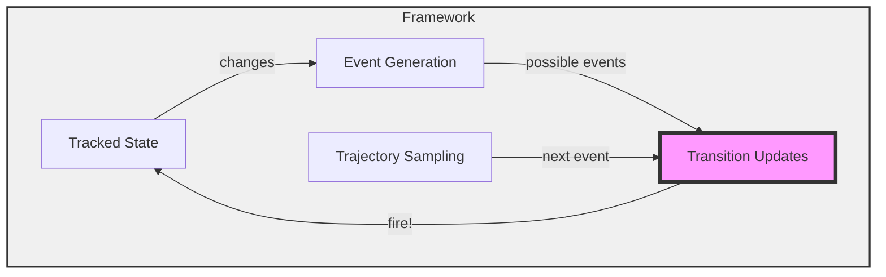

# ChronoSim.jl Framework Architecture

## Core Components and Data Flow

## Component Descriptions

- **Transition Updates**: The central orchestrator that manages event firing and state transitions
- **Tracked State**: Monitors and tracks all state changes in the physical system
- **Event Generation**: Creates new possible events based on state changes
- **Trajectory Sampling**: Selects the next event to fire based on the stochastic process

## Data Flow

1. **fire!**: Transition Updates executes state changes through the Tracked State
2. **changes**: Tracked State reports what changed to Event Generation
3. **possible events**: Event Generation provides new/updated events to Transition Updates
4. **next event**: Trajectory Sampling selects which event fires next from the available events
