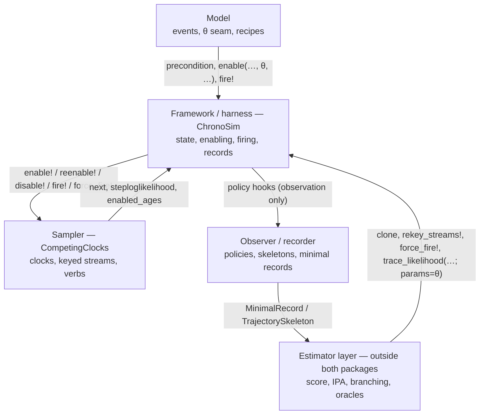

```@meta
CurrentModule = ChronoSim
```

# How the system fits together

Derivative estimation for a continuous-time discrete-event simulation is not
one package's job. Five components cooperate, each with a deliberately narrow
view of the others, and the guarantees documented in
[the reference](@ref "The framework guarantees, as implemented") are the
contracts at their seams. This chapter names the components, what flows across
each seam, and — just as important — what each component must never know.

## The five components



**The model** is what a user writes: event types with `precondition`,
`enable(event, physical, θ, when)`, and `fire!`, plus optional
[`DistRecipe`](@ref) declarations and the per-event
[memory declaration](@ref "Declarations: coupling and memory").
The model owns everything a trajectory only *reads*: transition structure,
distribution builders, policies. It never touches a sampler and never sees an
estimator.

**The framework (ChronoSim)** owns the running world: the observed physical
state, the dependency network that decides which events to re-examine, the
enabled-event and enabling-time tables, the firing loop, the memory bank, the
fire streams, and the record machinery. It calls the model at the seams and
drives the sampler through verbs.

**The sampler (CompetingClocks)** owns clocks and randomness mechanics: which
enabled clock fires next and when, per-clock keyed streams, the carry/redraw
implementations, forced firing, and the step-likelihood primitive. It answers
`next`, `steploglikelihood`, and `enabled_ages`; it asks nothing.

**The observer/recorder** is any [`ExecutionPolicy`](@ref) (or watcher inside
CompetingClocks): [`RecordMinimal`](@ref), [`RecordSkeleton`](@ref), probes,
invariant checkers. Observation is one-way — a policy never mutates state,
never draws, and a run without one is byte-identical to the same run with one.

**The estimator layer** lives *outside both packages*. It consumes records,
clones, forced firings, and the θ seam through public surfaces only. The
reference implementations are in the WorldTimer research repository:
`src/RecorderScore/` (the score-function estimator running entirely off
recorder records) and `src/ChronoBranch/` (the weak-derivative branching
estimator of [Cloning and branching](@ref "Cloning and branching")). Both
validate against exact CTMC oracles.

## What flows across each seam

* **Model → framework:** a Bool (`precondition`), a `(distribution, te)` pair
  (`enable`/`reenable`), and state mutations (`fire!`). The framework captures
  reads and writes as it calls; that capture *is* the dependency information.
* **Framework → sampler:** verbs with realized distributions and relative
  enabling times — `enable!`, `reenable!`, `disable!`, `fire!`,
  `force_fire!`. No θ, no state, no model objects cross this seam; the
  re-evaluation coupling is fixed on the sampler at construction, not passed
  per call.
* **Sampler → framework:** `next(ctx)` (the race winner), `steploglikelihood`
  (the per-step likelihood primitive, which with `which=nothing` doubles as the
  censoring survival), and `enabled_ages` (the competing set with ages, for
  estimators that build selection distributions).
* **Framework → observer:** hook calls carrying the firing's public facts
  (clock, event, time, changed places), from which records are built.
* **Estimator → framework:** the estimator drives whole-world verbs — `clone`,
  `rekey_streams!`, `force_fire!`, `trace_likelihood(…; params=θ)` — and reads
  functionals from state or records.

## What each component must never know

These prohibitions are load-bearing; each one keeps a class of bugs
unrepresentable.

* **The sampler never holds θ.** It receives realized distributions and
  samples them at concrete `Float64` values. A sampler that stored parameters
  could disagree with the likelihood about what they were; one that cannot
  store them cannot.
* **Estimators never touch backend internals.** Everything an estimator needs
  is a context- or FSM-level verb. The one historical exception —
  `enabled_ages` reaching through to the raw sampler — was promoted to a
  context-level query.
* **Derivatives never enter the hot loop.** Forward simulation runs at primal
  `Float64` throughout; dual numbers appear only in replay/evaluation
  (`trace_likelihood` at a dual θ) or in estimator-owned computations (a
  selection pmf differentiated by the estimator). Sampling happens at a
  concrete parameter point; only scoring is differentiated.
* **The model never knows it is being differentiated, recorded, or cloned.**
  A model written against the seams works under every estimator; that is the
  point of the seams.
* **Observers never influence the trajectory.** Recording is free to turn off
  and invisible when on.

## Which component owns which guarantee

| Guarantee | Owner |
|---|---|
| G1 pure enabling + verified incrementalization | ChronoSim (read capture, declarations, audit, effect check) |
| G2 state as a value, clone | ChronoSim (`clone(sim)`, `clone(physical)`); CompetingClocks contributes the context clone + `copy_clocks!` |
| G3 deterministic firing, detection of fire-randomness | ChronoSim ([`CountingRNG`](@ref), `fire_random`) |
| G4 the θ seam and the recipe | the model publishes it; ChronoSim threads `params` |
| G5 minimal record + replay-is-the-same-loop | ChronoSim ([`MinimalRecord`](@ref), shared step loop) |
| G6 coupling + memory | memory declared in the model and plumbed by ChronoSim; the re-evaluation coupling chosen at sampler construction and executed by CompetingClocks (`NextReactionMethod(coupling=...)`, `reenable!`, `supports_carry`) |
| G7 canonical keyed streams | CompetingClocks (`KeyedStreams`) + ChronoSim (master seed, fire streams) |
| G8 functional lowering + score/IPA pairing | the estimator layer; ChronoSim supplies the censored, differentiable likelihood |

## Related

* [Architecture](@ref "ChronoSim.jl Framework Architecture") — the
  original component diagram of the framework's inner loop, which this chapter
  places in the larger landscape.
* [The framework guarantees, as implemented](@ref "The framework guarantees, as implemented")
  — each guarantee with its invariant, API, and pinning test.
